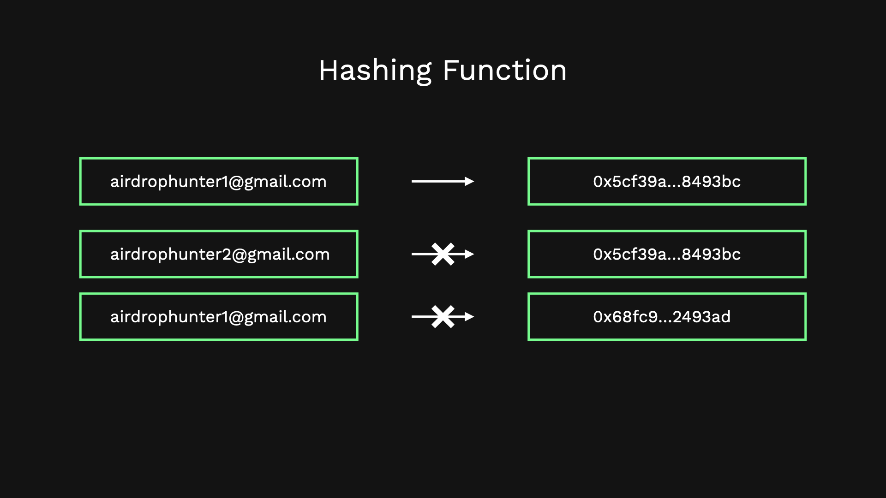
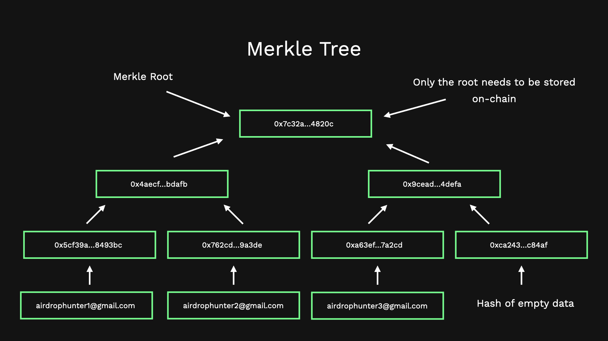
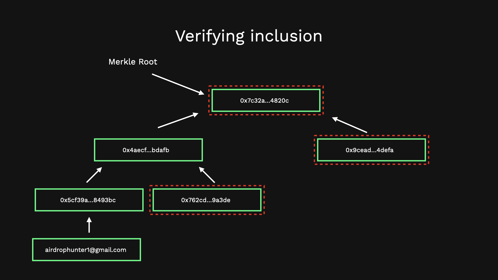

# Merkle Proofs explained

Imagine you are building a ticketing app and were given a task of whitelisting email addresses that are eligible for ticket to the event.

Let's assume the app is to be built on Ethereum blockchain so that it is highly available for users to use and is fairly resistant to censorship.

Naturally you might think to store the email addresses on Ethereum as well so that the smart contracts of the app has a way to find if an email address is eligible for the ticket or not.

<!--
One good place to store the email list would be the Ethereum blockchain since data stored on Ethereum is highly available. -->

However, when you try storing the email addresses you come to know that it is very expensive!

So how can you store data on-chain (on Ethereum) in an economically feasible way so that the app has some way to verify whitelist status for the input email address.

## Introducing Merkle proofs

Merkle proofs is a technique using which you can perform inclusion verification on a large set of data (eg: Email addresses) without having to store the entirety of the data on-chain.

### How does it work?

Before we jump into Merkle proofs we need to understand the different components

-   Hashing Function
-   Merkle Tree

#### Hashing Function

Hashing functions are one-way function that takes in some data (eg: Email address) and returns a determinstic value which cannot be used to obtain the underlying data that was used to calculate it.

A small change in input should lead to a drastic change in output of the function.

Hashing functions are supposed to be:

-   Collision-free i.e No 2 different values should result in the same output
-   Determinstic i.e Given the same value the result should always be the same



#### Merkle Tree

Merkle tree is a balanced binary tree where the leaf nodes are hashed version of the data which is a set against which later the inclusion of any input data is to be tested.

Every intermediate layer of the tree is formed by taking the hash of the nodes below it.

The unique property of the tree is that only storing the root node of the tree called **Merkle Root** on-chain and the intermediate nodes offline is enough to verify inclusion of any input data.

Here is a pictorial respresentation of a Merkle tree formed using only 3 pieces of data:



##### Verifying Inclusion

To verify inclusion of an input email/data the following is needed:

-   The email
-   Intermediate merkle nodes (stored offline)
-   Merkle root (which is already on-chain)

Using the email we can calculate it's hash, then using the intermediate nodes we can calculate the parent nodes hence travesing towards the top of the tree and finally calculating the root of the tree with the provided input email as the part of the tree.

Once the root is calculated we compare the root with the one stored on-chain. If they match then the email is indeed part of the tree. If the roots don't match then the tree constructed using the provided input email is not the same as the valid tree and hence the email is not part of the tree or included in the whitelisted set.

Here is a pictorial representation on how the verification would look like:



This is how Merkle tree & Merkle root/proof can be used to verify inclusion of a data item in an economically feasible way!

#### Caveats

There are few caveats on how Merkle tree implementations can vary.

##### Handling Empty Branches

Merkle tree is a balanced tree which means every layer has to have **even number of nodes** if not then the missing node has to be added which be either a duplicate of the adjacent node or an empty data node.

##### Technique to manage order of nodes

The order in which the nodes are hashed to calculate the parent node may be important depending on the implementation.

One may implement the pair hashing (hashing the nodes to calculate their parent node) in a way that no information about the ordering might be required. This can be done by sorting the nodes based on their contents or performing Symmetric hash (XOR before hash) of the nodes before calculating their parent.

Depending on how this is implemented, during verification the information about the ordering of the intermediate nodes might also be required.

### How to implement Merkle tree construction

#### Constructing base layer of the tree

```ts
/**
 * Preferred way of going from plaintext to hashed data for merkle leaves
 *
 * @param data Data to be hashed
 * @returns data in hashed format
 */
const dataToHash = (data: string) => {
    return keccak256(toHex(data, { size: 32 }));
};

/**
 * Takes in array of plaintext data and constructs the base layer of the merkle tree.
 *
 * @param nonHashLeaves array of data
 * @returns array of merkle leaves that form the base layer of the merkle tree
 */
const prepareBaseLayer = (nonHashLeaves: string[]): Leaf[] => {
    let hashedLeaves: Leaf[] = [];

    for (let i = 0; i < nonHashLeaves.length; i++) {
        hashedLeaves.push(dataToHash(nonHashLeaves[i]));
    }

    return hashedLeaves;
};
```

-   The function `dataToHash` takes in the individual pieces of data and hashes them to form the Merkle leaves. Here I am using the standard hash function in web3 (keccak256)

#### Calculating parent nodes and eventually root node

```ts
/**
 * Preferred way of calculating the parent merkle node
 *
 * @param a one of the merkle node
 * @param b other merkle node to be hashed with a
 * @returns parent merkle node
 */
const pairHash = (a: Node, b: Node) => {
    /**
     * Lexicographical sorting helps with the ordering of the nodes
     * If sorting is not done then during verification the information about the order
     * whether the given node is a left or right node has to be also provided.
     */
    const left = a > b ? b : a;
    const right = left == a ? b : a;

    return keccak256(
        encodeAbiParameters(
            [
                { name: "left", type: "bytes32" },
                { name: "right", type: "bytes32" },
            ],
            [left, right]
        )
    );
};

/**
 * Takes a layer of merkle nodes as input, constructs a merkle tree and outputs the root of the tree
 *
 * @param layer layer of nodes for which the parent layer is to be calculated
 * @returns merkle root of the tree from the given layer
 */
const calculateMerkleRootFromLayer = (layer: Node[]): Node => {
    if (layer.length === 1) {
        return layer[0];
    }

    const validLayer = handleEmptyBranch(layer);

    const parentLayer: Node[] = [];

    for (let i = 0; i < validLayer.length; i += 2) {
        let left = validLayer[i];
        let right = validLayer[i + 1];
        let parent = pairHash(left, right);
        parentLayer.push(parent);
    }

    return calculateMerkleRootFromLayer(parentLayer);
};
```

Here I am handling empty branch by using a "0x" data node.

```ts
/**
 * Preferred way of handling empty branch in a merkle tree
 * Append a node with 0x as data
 * Other strategy could be duplicating the adjacent node
 *
 * @param layer
 * @returns array with even length consisting of merkle leaves
 */
const handleEmptyBranch = (layer: Node[]) => {
    if (layer.length % 2) layer.push(dataToHash("0x"));

    return layer;
};
```

Finally a function that abstracts away the complexity from the user and only takes in data in plaintext format to calculate the merkle root.

```ts
/**
 * Given an array of data constructs a merkle tree and outputs the root of the tree
 *
 * @param data array of data for which the merkle root needs to be calculated
 * @returns merkle root of the merkle tree formed using the data provided
 */
const calculateMerkleRootFromData = (data: string[]): Node => {
    const baseLayer = prepareBaseLayer(data);

    const root = calculateMerkleRootFromLayer(baseLayer);

    return root;
};
```

### How to implement Merkle tree verification

```ts
/**
 * Calculates the merkle root using data and the intermediate proofs as if the data was part of the merkle tree.
 * Once the merkle root is calculated it is matched with the merkle root provided as input.
 * If matched then data is part of the tree
 * If not matched then data is not part of the tree (intermediate proofs have to be provided in the right order)
 *
 * @param data data that needs to be verified if it is part of the merkle tree
 * @param intermediateProofs intermediate merkle nodes which act as adjacent nodes when calculating the parent nodes
 * @param merkleRoot the actual merkle root against which the calculated merkle root will be matched with
 * @returns a boolean indicating whether data is the part of the valid set
 */
const verifyProof = (
    data: string,
    intermediateProofs: Node[],
    merkleRoot: Node
): boolean => {
    const dataNode = dataToHash(data);

    let nextNode = dataNode;

    for (let i = 0; i < intermediateProofs.length; i++) {
        nextNode = pairHash(nextNode, intermediateProofs[i]);
    }

    return nextNode === merkleRoot;
};
```

### How to use

```ts
console.log(calculateMerkleRootFromData(emailAddress));

// Example Merkle root verification for valid data

// Calculating merkle root for adjacent data in the base layer
const merkleNode = dataToHash("airdrophunter1@gmail.com");

console.log(
    verifyProof(
        "airdrophunter2@gmail.com", // Data to be tested for inclusion
        [
            merkleNode,
            // I console logged the intermediate nodes and put them here.
            "0xbb6fbadeae6523789e06658ab747efe2b59d01e5b281cd709aa49cd10a4323c4",
        ],
        "0x2c2f3c0b4bd0618ef3b40c5c787e594e2c662fdcde94053f86d8d32c3bf78d6e"
    )
);
```

#### Additional resources

[MERKLE PROOFS FOR OFFLINE DATA INTEGRITY](https://ethereum.org/developers/tutorials/merkle-proofs-for-offline-data-integrity) - Ethereum Docs
